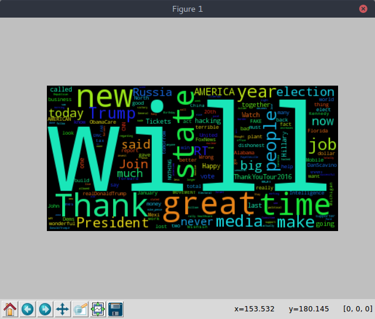

# Twitter Word Cloud
Finds the most common words in a users tweets and outputs it as a word cloud. 
This script parses out urls and other url related phrases.  

First, get access to twitter's API and insert the credentials into the proper place in the authenticate function. 

Second, run the program by typing                 
```
python3 twitter_wordcloud.py
```             
into a terminal. 

Finally, simply enter the user's screen name when you see               
```
Enter twitter handle of user:
```             

Here is the word cloud for Donald Trump's twitter account, @realDonaldTrump:               
                                  
                                  

