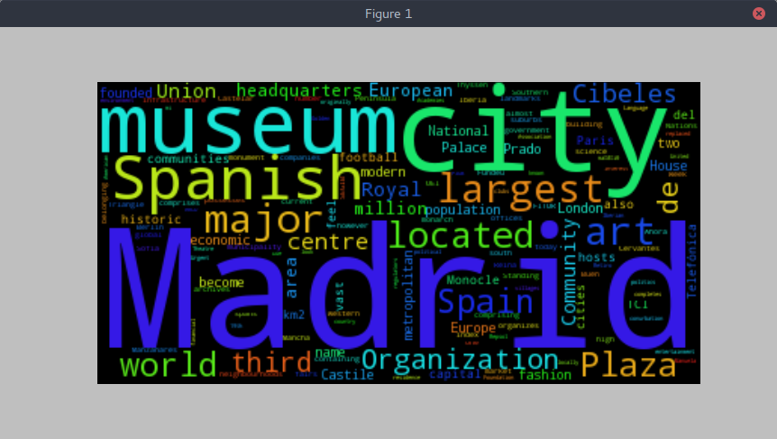

# Wikipedia Word Cloud
Finds the most common word in a wikipedia article and outputs it as a word cloud.
                  
You can run the program by typing 
```
python3 most_common_words.py 
```
into a terminal.                  
                     
                     
Simply enter what you want to look up when you see                   
```
Enter search item:
```
If you do not know what you want to look up, simply enter nothing and the program will randomly select a word from test.txt and look it up for you, so that you can see an example.                     
                             
      
Here is the word cloud for Madrid: 


